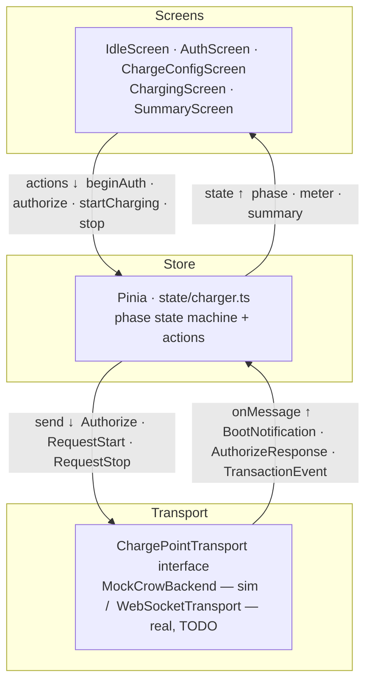
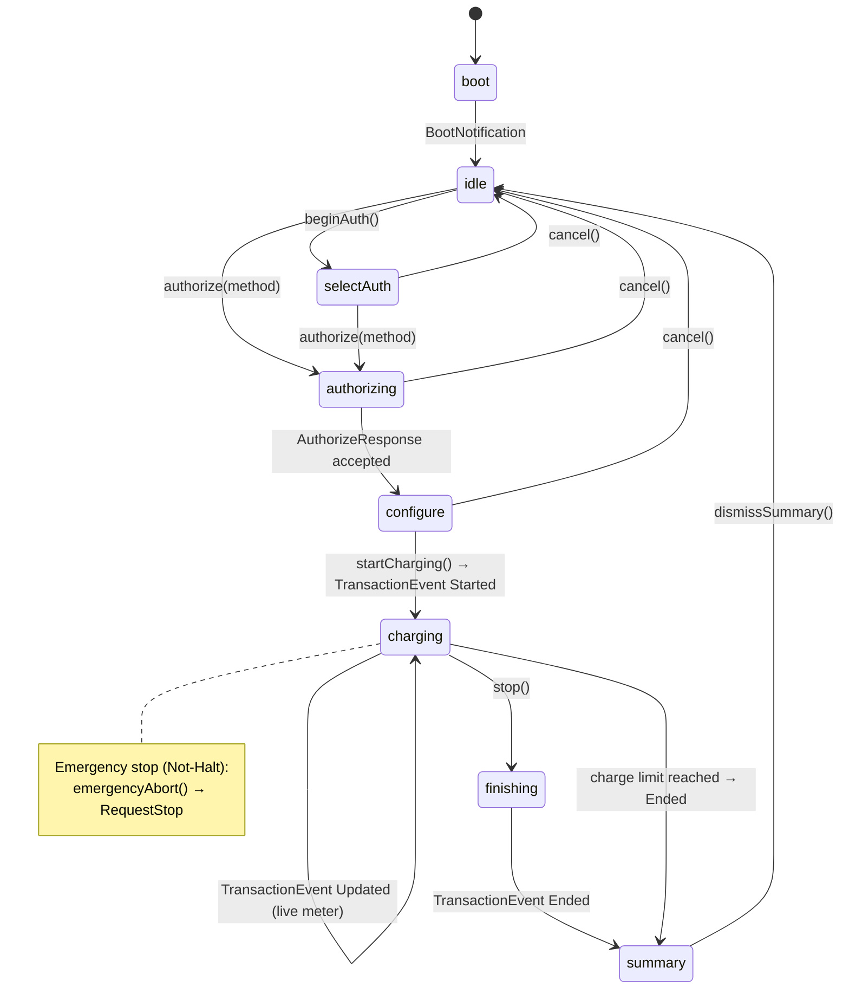
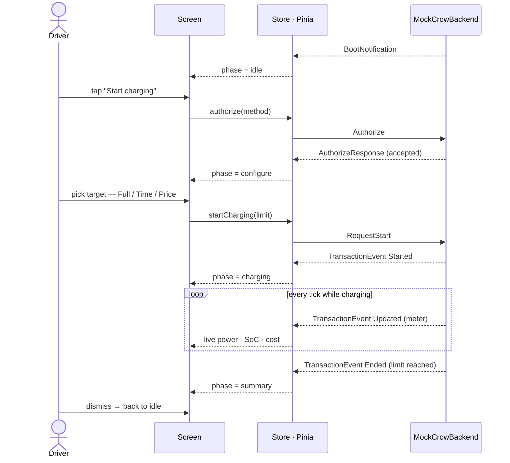

[README.md](https://github.com/user-attachments/files/30262058/README.md)
# Charger Interface

`Vue 3` `TypeScript` `Vite` `Tailwind CSS`

A simulated HMI for a DC fast charger. No charger attached, no OCPP backend, no payment provider. Just the screen a driver looks at while their car is charging, and the state machine behind it.

The idea came from standing in front of a real one. Alpitronic builds Hyperchargers about twenty minutes by bike from here, so I rode over and watched the display through a full session. Almost nobody reads it. People plug in, glance at the screen once, and go back to their phone. That changed what I thought I was building.

## What it does

- The full session as one state machine: idle → authentication → plug in → charging → complete
- A simulated charging curve, so power tapers off as the battery fills instead of sitting at maximum until 100%
- Error states you can trigger by hand: authentication failed, cable not detected, emergency stop
- Language switch between German, Italian and English (this is South Tyrol, everything here is bilingual anyway)
- Touch targets sized for someone standing outside wearing gloves
- Dark theme, high contrast, oversized numbers, because the thing lives outdoors in the sun

## How it's built

Vue 3 with the Composition API, single file components, TypeScript, Tailwind for styling, Vite as the dev server. No backend, no router, no state library.

Everything hangs on one composable, `useChargingSession`. A single reactive state value, transitions as named functions (`authenticate()`, `plugIn()`, `startCharging()`, `abort()`), and each transition checks whether it's legal from where the session currently is. The screens are dumb: props in, events out, they never touch session state directly. Adding the error handling afterwards took about an hour, because there was exactly one place to add it.

## Architecture at a glance

Three layers, and data only ever moves in a loop. A driver's touch goes **down** — screen → store → charger. Fresh charger data comes back **up** — charger → store → screen re-renders. The current build centres on a single Pinia store (`state/charger.ts`) that talks *only* to a `ChargePointTransport` interface, so the simulated charger can be swapped for a real WebSocket backend without touching a single screen.



### The session as a state machine

One `phase` value decides which screen is on the display. Every transition is a named action that first checks whether it's legal from the current phase — the reason the "car charging but not authenticated" bug from the early boolean version simply can't happen anymore.



### A full session, end to end

The happy path as messages between the driver, the screen, the store and the simulated charger. The store never blocks — it fires a request and waits for the backend to report back, exactly like a real OCPP charge point would.



## What I learned

### Booleans are not a state machine

The first version had `isAuthenticated`, `isPlugged`, `isCharging`, `hasError`. Four booleans, sixteen combinations, maybe five of which make sense. At some point while clicking around I ended up in a state where the car was charging but not authenticated, which is a great thing for a payment screen to do. Rewriting it as one state value with named transitions deleted more code than it added.

### Coming from Angular signals

I know Angular, and `ref` and `computed` felt close enough to signals that I got careless. Destructured a `reactive` object, lost the reactivity, then spent twenty minutes staring at a value that refused to update in the template while `console.log` cheerfully showed it changing. What stuck: `ref` for values, `reactive` only with a reason, and never destructure it.

### Fake data still has to be plausible

My first charging simulation added one percent of state of charge per tick and pushed the power straight to maximum. It looked wrong immediately, and I don't even own an electric car. Real charging tapers hard: high power while the battery is empty, dropping off long before it's full. What I have now is a small lookup curve keyed on state of charge. It isn't physics, but nobody watching it thinks "batteries don't do that."

### The happy path is the small part

Plug in, authenticate, charge, drive off. That was an afternoon. Everything after it took much longer: what the screen says when the cable won't unlock, what happens when someone walks away mid-session, what a driver sees when payment fails while their car is still plugged in. Most of the interesting UI is the part you hope nobody ever sees.

### A screen outdoors is a different problem

Sunlight on a glossy panel erases anything mid-grey. Thin fonts disappear. Someone standing up with a cable in one hand doesn't read paragraphs. That's the whole reason the numbers are huge and the labels are three words long.

## Running it locally

You need Node.js. That's the whole list, there's no database and no API key.

```bash
git clone https://github.com/FlorianBohrer/charger-interface-demo.git
cd charger-interface-demo
npm install
npm run dev
```

Vite serves it at http://localhost:5173. Resize the window to something landscape and roughly tablet sized, that's the format it's built for.

```bash
npm run dev        # dev server
npm run typecheck  # vue-tsc --noEmit
```
