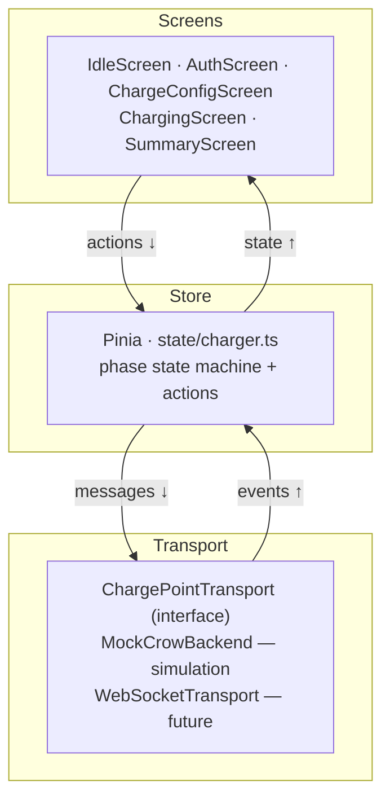
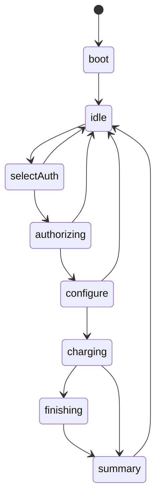
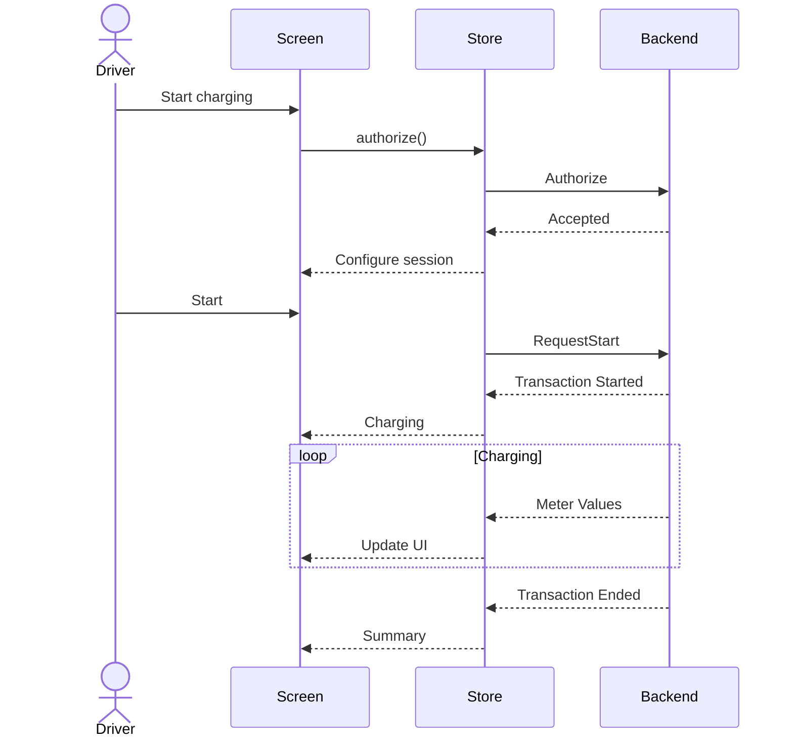

# Charger Interface

> **Interactive HMI prototype inspired by real Alpitronic Hyperchargers.**
>
> A DC fast-charger touch interface built with **Vue 3**, **TypeScript**, **Pinia** and **Tailwind CSS** — modelling a full charging session as a finite state machine, with a realistic charging simulation and an architecture ready for a real OCPP backend.


**🔗 Live Demo:** _coming soon_ · **📸 Demo GIF:** _add `docs/demo.gif`_

> _Independent study project. Not affiliated with or endorsed by Alpitronic. "Hypercharger" is a trademark of its respective owner._

---

## Overview

This is a simulated Human-Machine Interface (HMI) for a DC fast charger. There is **no physical charger, payment provider or OCPP backend** connected — the project focuses entirely on the driver's experience during a charging session and on the architecture behind it.

The idea came from standing in front of a real charger. Alpitronic builds Hyperchargers about twenty minutes by bike from where I live, so I rode over and watched people use them. Almost nobody reads the display: they plug in, glance at the screen once, and immediately return to their phone.

That observation changed how I approached the interface. Instead of building "another charging screen", I designed one that communicates only the information a driver actually needs within a few seconds.

---

## Tech Stack — and why

| Tool | Why it's here |
| --- | --- |
| **Vue 3** (Composition API) | Component isolation and reusable composables |
| **TypeScript** + discriminated unions | Model connector status & charge limits as unions so **invalid states are unrepresentable** |
| **Pinia** | A single `phase` state machine instead of several scattered booleans |
| **`ChargePointTransport` interface** | The UI talks to *one* interface → mock ↔ real WebSocket backend are swappable |
| **Tailwind CSS** | Fast iteration on a high-contrast, large-target kiosk layout |
| **Vite** | Instant dev server and HMR |

---

## Key Features

- Complete charging session modelled as a **finite state machine** (only legal transitions allowed)
- **Realistic charging curve** — power tapers as state of charge rises (see [Design Decisions](#design-decisions))
- **OCPP-inspired** message flow (`Authorize`, `TransactionEvent`, `MeterValues`)
- **Guarded states & error handling** — emergency stop (Not-Halt) overlay, connector fault state, and transitions that make "charging without authorisation" impossible
- **Configurable charging** — full charge, by duration, or by price (auto-stop at the limit)
- **Kiosk design for outdoor use** — large typography and high contrast for sunlight readability on a 22" touchscreen
- **Accessible motion** — respects `prefers-reduced-motion` (animations and the particle background fall back to a static frame)
- **i18n layer (DE/EN)** — small `useI18n` composable with parameterised keys; architecture in place, catalogs in progress
- **Transport abstraction** prepared for a real backend

---

## Screens

> ⚠️ Add real screenshots to `docs/` — the links below are placeholders.

| Idle | Charging |
| --- | --- |
|  |  |
| **Summary** | **Error / Emergency** |
|  |  |

---

## Architecture

The app is layered into **presentation → business logic → transport**. Every interaction travels downward; charger events propagate upward. UI components stay independent of the communication layer, which is what makes swapping the simulated backend for a real WebSocket transport straightforward.



---

## Session State Machine

The charging workflow is a finite state machine — a single `phase` value instead of independent booleans, so impossible states (e.g. charging without authentication) can't occur.



---

## End-to-End Session

The store behaves like a real charge point: instead of mutating the UI directly, it sends requests and waits for charger events before updating.



---

## Design Decisions

### Finite State Machine
The first version used several boolean flags, which quickly produced invalid states such as "charging without authentication". A single `phase` state machine removed that whole class of bugs and made illegal transitions impossible.

### Component Isolation
Screens never mutate session state directly — every interaction triggers a clearly named store action. This keeps the UI predictable and the data flow one-directional.

### Transport Abstraction
The UI communicates only through the `ChargePointTransport` interface. Today it's backed by a simulated charger (`MockCrowBackend`); a `WebSocketTransport` could connect to a real OCPP backend **without changing a single screen component**.

### Realistic Charging Behaviour
Charging power is **not** linear. It's computed from a piecewise curve — full power up to ~55 % SoC, a linear taper to ~80 %, then a steep drop — mirroring real thermal/battery limits. Time is accelerated for the demo.

### Outdoor Readability
Designed for a public 22" touchscreen in direct sunlight: large typography, strong contrast, minimal text, and generous touch targets.

---

## Testing

State-machine transitions are the natural unit to test (legal vs. illegal transitions, meter updates). _Planned — see [Future Improvements](#future-improvements)._

---

## Folder Structure

```text
src/
  components/     # Screens + UI (StatusBar, ConnectorBadge, ChargeCurve, ParticleField, overlays …)
  state/          # Pinia stores (charger = FSM, ui) + helpers (format, useClock, i18n, useFitScale)
  composables/    # useTariff (live day-ahead electricity price)
  sim/            # ocpp.ts (protocol types), transport.ts (interface), MockCrowBackend.ts (simulation)
```

---

## Running Locally

```bash
git clone https://github.com/FlorianBohrer/charger-interface-demo.git
cd charger-interface-demo
npm install
npm run dev
```

Then open <http://localhost:5173>.

```bash
npm run dev         # dev server (Vite + HMR)
npm run typecheck   # vue-tsc --noEmit
```

---

## Future Improvements

- Real `WebSocketTransport` + OCPP integration
- Unit tests for the state machine
- Complete DE/EN catalogs (and add Italian)
- Payment provider, diagnostics, OTA updates
- Multiple chargers / connector availability
- Remote monitoring dashboard

---

## What I Learned

This project taught me more than "another frontend app". I learned how much cleaner a complex workflow becomes when modelled as a finite state machine, how valuable clear architectural boundaries are, and how different designing for a public outdoor display is from a traditional web app.

The most surprising lesson: **the happy path is the small part.** Most of the engineering went into everything that happens when things *don't* go as planned.
